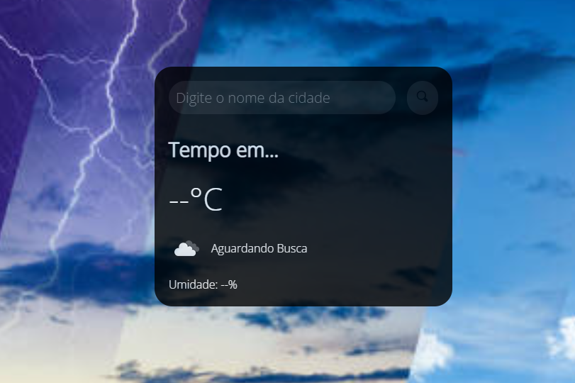

# ☁️ Weather Forecast App

Uma aplicação interativa de previsão do tempo que permite aos usuários buscar condições climáticas em tempo real de qualquer cidade do mundo. O projeto foca em uma interface limpa, utilizando efeitos de transparência (Glassmorphism) sobre um fundo dinâmico.

> **Status:** Funcional ✅

---

## 🚀 Funcionalidades

* **Busca por Cidade:** Digite o nome de qualquer cidade para obter dados instantâneos.
* **Dados em Tempo Real:** Exibe temperatura em graus Celsius (°C).
* **Indicadores Climáticos:** Mostra a condição atual (ex: nuvens, sol) e a umidade relativa do ar.
* **Interface Adaptativa:** Design moderno com foco em legibilidade e estética.

## 🛠️ Tecnologias Utilizadas

* **HTML5:** Estrutura dos elementos de busca e exibição.
* **CSS3:** Estilização avançada com bordas arredondadas e fundos semitransparentes.
* **JavaScript:** Consumo de API de clima e manipulação dinâmica do DOM.

## 📸 Demonstração

Aqui está o visual atual da aplicação:



## 📂 Estrutura de Arquivos

* `index.html`: Estrutura principal da interface de busca.
* `style.css`: Design e efeitos visuais do card de tempo.
* `script.js`: Lógica de busca e integração com a API.
* `img/`: Pasta contendo o print de demonstração e ícones.

## ⚙️ Como rodar o projeto

1. Clone este repositório:
   ```bash
   git clone [https://github.com/vinicius311006/NOME-DO-SEU-REPOSITORIO.git](https://github.com/vinicius311006/NOME-DO-SEU-REPOSITORIO.git)
